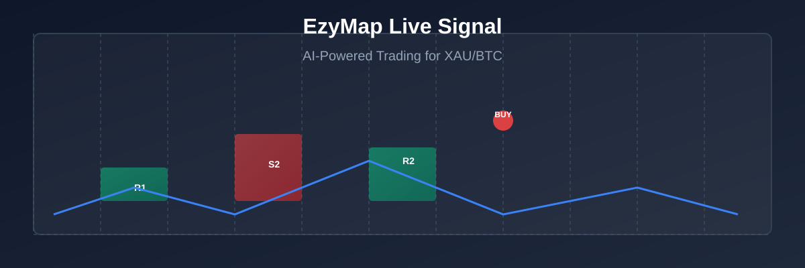

# EzyMap — TradingView Pine Script for Gold & Bitcoin Markets

<div align="center">


<br/>
<br/>

# 🚀 Precision Market Analysis & Live Trading Signals



</div>

<div align="center">

## 🗺️ Zones • 🎯 Signals • 📊 Analytics

EzyMap is a Pine Script v6 TradingView indicator for XAUUSD/BTCUSD (and other symbols) that maps higher-timeframe support/resistance zones and generates live BUY/SELL trade signals with detailed Telegram-ready alerts, a trade card, and a dashboard. Every version is kept as its own file for easy comparison and tracking.

</div>

<div align="center">

## 📈 Current Version

**`EzyMap_Pro_V3_0.pine`** is the newest build, on branch `claude/pine-script-live-signals-a3w95t`.

> **⚠️ Not Yet Compiled.** V3.0 combines a large batch of changes (expectancy math, entry selectivity filters, and a plan-builder consolidation) in one pass with no TradingView compiler access during development. Test it in the Pine Editor before using it for live alerts. `EzyMap_Pro_V2_0.pine` is the last version that's been through a real user compile pass and is a safer fallback if V3.0 needs fixes.

</div>

<div align="center">

## 📊 Active Lineage

The current line of development restarted from V1.4 (its live-signal quality outperformed the later V2/V3 experiments below) and moved forward from there:

| File | What changed |
|------|-------------|
| `EzyMap_Pro_V1_4.pine` | Baseline: refined S1/S2/R1/R2 zone construction |
| `EzyMap_Pro_V1_5.pine` | Reliability fixes ported from the V2 line + close-to-high/low-to-close zone sizing |
| `EzyMap_Pro_V1_6.pine` | Raised minimum confluence threshold (win-rate experiment) |
| `EzyMap_Pro_V1_7.pine` | Reverted confluence to 0; live signal triggers from LOW RISK zones only |
| `EzyMap_Pro_V1_8.pine` | HIGH and LOW risk zones both independently trigger live signals |
| `EzyMap_Pro_V1_9.pine` | Added fair value gap (FVG) fill as a confirmation type |
| `EzyMap_Pro_V2_0.pine` | **Rebuild Stage 1 — tally fixes** (see below) |
| `EzyMap_Pro_V3_0.pine` | **Rebuild Stages 2–4 combined** — expectancy, selectivity, plan-builder consolidation |

Every version is kept as its own file rather than overwritten, so any two versions can be diffed or compared directly on chart.

</div>

<div align="center">

## 🔄 The V2 Rebuild Plan

Starting at V2.0, development follows a staged audit-and-rebuild plan (tally → expectancy → win rate → architecture, in that order):

**Stage 1 (V2.0, done):** tally fixes — the chart and Telegram alerts now describe the same trade every time. Expect the apparent historical win rate to look lower than earlier versions; that's measurement error being removed, not a regression.

**Stages 2–4 (V3.0, combined per request):** expectancy (R:R floor, structural stops, two-target exit, spread modeling), selectivity (tiered confirmation, zone-anchored CHOCH, session/volatility/cooldown gates), and a partial architecture cleanup (a single shared plan-building function). The plan's own recommendation was to roll these out separately and A/B test the selectivity filters one at a time; V3.0 bundles them, so if results look off there's no way to isolate which change is responsible.

</div>

<div align="center">

## 📦 Other Files in This Repo

**Lite Builds:** `EzyMap_Lite_V1_0.pine`, `EzyMap_Lite_V3.pine` — map-only builds (zone drawing, no live signal engine), lighter weight for chart-reference use.

**Legacy Gold/BTC Lineage:** `EzyMap_Gold_BTC_v4_5_2.pine` through `v4_7_0.pine` — earlier legacy lineage that the V1.x/Pro series builds on.

**Experimental V2/V3 Branch:** `EzyMap_Pro_V2.pine` through `V2_4.pine`, `EzyMap_Pro_V3.pine`, `V3_1.pine` — superseded when development restarted from V1.4 (see "Active Lineage" above). Kept for reference, not part of the current path.

</div>

<div align="center">

## 🚀 Quick Start

Open the current version's `.pine` file, copy its contents into TradingView's Pine Editor, and add it to a chart. Inputs are grouped under Engine, Confirmation, Risk, Display, Alerts, and Trade Management in the indicator's settings panel.

```bash
# Open EzyMap_Pro_V3_0.pine in TradingView
# Test in Pine Editor before using for live alerts
```

📦 Copy-paste quickstart scripts for **XAUUSD & BTCUSD** → [`examples/quickstart/`](/examples/quickstart/)

</div>

<div align="center">

## 📱 Supported Platforms

**Primary Targets:** XAUUSD (Gold spot) • BTCUSD (Bitcoin spot)

**And many more symbols!**

### Available Indicators

| Type | File | Description |
|------|------|-------------|
| Pro Line | `EzyMap_Pro_V3_0.pine` | Full signal engine + zones |
| Pro Lite | `EzyMap_Lite_V3.pine` | Zones only |
| Legacy Pro | `EzyMap_Pro_V1_4.pine` | Baseline stable version |
| Legacy Gold/BTC | `EzyMap_Gold_BTC_v4_7_0.pine` | v4 legacy lineage |

</div>

<div align="center">

## 🏆 What's New

> Recent highlights from **V1.4 → V3.0**. Full history in [`CHANGELOG.md`](CHANGELOG.md).

**🎯 Enhanced Expectancy** — R:R floor, structural stops, two-target exits, spread modeling  
**🔍 Tiered Confirmation** — FVG, CHOCH, session/volatility/cooldown gates  
**🏗️ Plan Builder Consolidation** — Single shared plan-building function  
**📊 Live Tally Fixes** — Chart and Telegram alerts describe the same trade every time  
**⚠️ Risk-First Approach** — LOW RISK zones trigger live signals  
**⚡ Advanced Zone Sizing** — Close-to-high/low-to-close sizing  
**🔄 Version Control** — Every version kept as separate file for direct comparison

</div>

<div align="center">

## 📊 Features

### 🗺️ Zone Mapping
**S1/S2/R1/R2 Zones** — Refined high-probability support/resistance levels  
**Fair Value Gap (FVG)** — Confirmation type for trade entries  
**Zone-anchored CHOCH** — Confirmation based on zone breaks

### 🎯 Live Signals
**LOW RISK Triggers** — Signals from low-risk zones only  
**HIGH/LOW Risk Zones** — Both independently trigger live signals  
**Confluence Requirements** — Configurable minimum confluence thresholds

### 📱 Trading Features
**Telegram Alerts** — Detailed, trading-card format with full trade data  
**Trade Dashboard** — Live tracking of open/closed trades  
**Entry/Exit Planning** — Smart trade management with stop-loss/take-profit

### ⚙️ Configuration Options
**Engine Settings** — Signal generation and risk management  
**Confirmation Filters** — Multi-layer trade validation  
**Risk Management** — Structural stops and two-target exits  
**Display Options** — Chart overlays and UI customization  
**Alert System** — Telegram and TradingView alerts  
**Trade Management** — Position sizing and exit strategies

### 📈 Analytics
**Expectancy Math** — Statistical win rate and profit factor analysis  
**Risk Metrics** — Sharpe ratio, max drawdown, and volatility  
**Performance Tracking** — Live P&L and trade statistics

</div>

<div align="center">

## 🔗 Compatible Platforms

> EzyMap works with **TradingView** and its Pine Script v6 engine.

### How to Install

**1. In TradingView:** Open the Pine Editor (`Ctrl+E` or `Cmd+E`) → Copy the contents of the `.pine` file → Paste and save the indicator

**2. Configure:** Add to any chart (XAUUSD/BTCUSD recommended) → Adjust inputs in the settings panel → Test in paper trading first

**3. Use:** Monitor zone maps on higher timeframes → Watch for live signal triggers → Manage trades via the dashboard

### Quick Setup Commands

```bash
# TradingView Pine Editor Setup
# 1. Open Pine Editor
# 2. Copy EzyMap_Pro_V3_0.pine contents
# 3. Save as "EzyMap Pro v3.0"

# Alternative: Copy-paste quickstart
# `examples/quickstart/tradingview-setup.sh`
```

**⚠️ Important:** Test V3.0 in the Pine Editor before using for live alerts. `EzyMap_Pro_V2_0.pine` is the last compiled version and a safer fallback.

</div>

<div align="center">

## 📚 Resources

### Documentation
[📖 User Guide](docs/user-guide.md) — Complete setup and usage guide  
[🎛️ Configuration Reference](docs/config.md) — All input parameters explained  
[🔧 Installation Guide](docs/installation.md) — Step-by-step setup instructions

### Examples
[📊 Quick Start Examples](examples/quickstart/) — Ready-to-use configuration scripts  
[📈 Chart Templates](examples/templates/) — Pre-configured chart setups  
[💡 Best Practices](examples/best-practices/) — Optimization and usage tips

### Community
[🐛 Issues](https://github.com/printezy247/EzyMap/issues) — Report bugs and request features  
[💬 Discussions](https://github.com/printezy247/EzyMap/discussions) — General discussion  
[📝 Wiki](https://github.com/printezy247/EzyMap/wiki) — Additional documentation

### Support
**⚠️ Testing Only:** V3.0 is not yet compiled. Use V2.0 for production.  
**🔄 Version Control:** All versions kept as separate files for direct comparison.  
**📊 Performance:** Historical backtesting available in the repository.

</div>

<div align="center">

## 📊 Version History

<div align="center">

| Version | Status | What's New |
|---------|--------|------------|
| `V3.0` | ⚠️ Uncompiled | Expectancy, selectivity, plan-builder consolidation |
| `V2.0` | ✅ Compiled | Rebuild Stage 1 — tally fixes |
| `V1.9` | ✅ Compiled | FVG fill as confirmation type |
| `V1.8` | ✅ Compiled | HIGH/LOW risk zones independently trigger |
| `V1.7` | ✅ Compiled | LOW RISK zones only trigger live signals |
| `V1.6` | ✅ Compiled | Raised minimum confluence threshold |
| `V1.5` | ✅ Compiled | Reliability fixes + zone sizing |
| `V1.4` | ✅ Compiled | Baseline: refined S1/S2/R1/R2 zone construction |

</div>

**📖 Full changelog available in [`CHANGELOG.md`](CHANGELOG.md)**

</div>

<div align="center">

## 🤝 Project Status

> **🚀 In Active Development** — Building the future of Pine Script indicators for crypto and precious metals trading.

### Development Philosophy
**🔄 Iterative Rebuilds** — Staged audit-and-rebuild plan for quality  
**📊 Statistical Rigor** — Expectancy math and win-rate experiments  
**🛡️ Risk-First** — Signal generation from low-risk zones only  
**🔧 Version Control** — Every version kept separate for direct comparison  
**⚡ Performance Focus** — Structural stops and two-target exits

</div>

<div align="center">

## ✨ Get Started Today

**🔧 Ready to Trade?** Install EzyMap_Pro_V3_0.pine in TradingView now!

**⚠️ Warning:** V3.0 is not yet compiled. Use V2.0 for production trading until V3.0 passes compilation.

**📈 Test First:** Always test new indicators in paper trading before live use.

</div>

<div align="center">

## 🔗 Connect

**📧 Questions & Support:**
[🐛 Report Issues](https://github.com/printezy247/EzyMap/issues) · [💬 Join Discussions](https://github.com/printezy247/EzyMap/discussions) · [📖 Documentation](https://github.com/printezy247/EzyMap/wiki)

**🚀 Development:**
[⭐ Star the repo](https://github.com/printezy247/EzyMap) · [🔄 Fork & Contribute](https://github.com/printezy247/EzyMap/fork) · [📊 View Changelog](CHANGELOG.md)

</div>

<div align="center">

## 📧 Subscribe

Get notified about new releases and trading insights:

<iframe src="https://github.com/sponsors/printezy247/card" title="Subscribe" width="600" height="150"></iframe>

**🌟 Support independent development and keep EzyMap free for everyone!**

</div>

<div align="center">

## 📊 OmniMap – Precision Trading Intelligence

> The ultimate trading companion for XAUUSD & BTCUSD — combining advanced zone mapping, live signal generation, and comprehensive trade management.

</div>

<div align="center">

<b>📱 Available in 5 languages</b>
<br/><br/>
<a href="README.md"></a>
<a href="docs/i18n/pt-BR/README.md"></a>
<a href="docs/i18n/es/README.md"></a>
<a href="docs/i18n/fr/README.md"></a>
<a href="docs/i18n/de/README.md"></a>

</div>